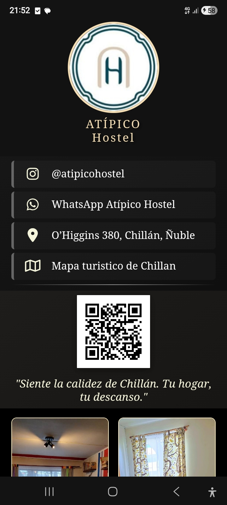

# PROYECTO: Tarjeta Digital - Atípico Hostel (PWA)
**Technical Stack:** Vanilla HTML5 / CSS3 / JavaScript  
**Deployment:** [https://tu-despliegue.vercel.app/]

## 1. Introducción
Este sistema representa una solución de software orientada a la transición digital comercial para **Atípico Hostel** (Chillán, Chile). Se trata de una **Progressive Web App (PWA)** diseñada bajo una filosofía de arquitectura funcional y minimalista, optimizada para ofrecer una interfaz fluida, elegante y de alto rendimiento en dispositivos móviles.

## 2. Previsualización del Sistema

  
  
<i>Interfaz ergonómica adaptativa con galería integrada y soporte PWA nativo.</i>

## 3. Problemática
El sector turístico y hotelero requiere canales inmediatos y sin fricciones para la captación de huéspedes. Este proyecto resuelve la necesidad de una plataforma de contacto centralizada que sea:
* **Accesible:** Sin necesidad de descargas previas desde tiendas de aplicaciones (App Store / Play Store).
* **Persistente:** Consultable con o sin conexión a internet mediante almacenamiento en caché.
* **Interactiva:** Integración directa con reservas por WhatsApp, ubicación en Google Maps, catálogo de imágenes y mapa turístico local.

## 4. Requerimientos del Sistema

### 4.1 Requerimientos Funcionales (RF)
* **RF-1:** Enlaces directos a canales oficiales (WhatsApp direct-chat, Instagram).
* **RF-2:** Sistema de geolocalización mediante API de navegación con Google Maps.
* **RF-3:** Acceso rápido a recursos locales (Mapa turístico de Chillán en alta resolución).
* **RF-4:** Módulo de galería responsiva en grilla ergonómica para exhibición del establecimiento.
* **RF-5:** Implementación de Service Worker para caché y disponibilidad offline.
* **RF-6:** Generación e integración de código QR nativo para escaneo presencial.

### 4.2 Requerimientos No Funcionales (RNF)
* **RNF-1 (Rendimiento):** Tiempo de carga crítico inferior a 1.5 segundos mediante código Vanilla puro (cero frameworks).
* **RNF-2 (Ergonomía):** Layout híbrido (viewport adaptable `100dvh` para perfil + scroll vertical fluido para galería).
* **RNF-3 (Instalabilidad):** Cumplimiento total del estándar PWA (`manifest.json`) para instalación nativa en pantalla de inicio con la marca *"Atípico Hostel"*.

## 5. Casos de Uso
* **Escenario A (Check-in / Recepción):** El huésped escanea el QR en la entrada y guarda la tarjeta en su teléfono como app nativa.
* **Escenario B (Turismo Sin Red):** El cliente consulta el mapa turístico o la ubicación del hostel en zonas de baja cobertura mediante la caché guardada.
* **Escenario C (Reservas Directas):** Un usuario en redes sociales accede al enlace y abre un chat directo de WhatsApp con la recepción en un solo toque.

## 6. Estructura de Ingeniería
* **`index.html`**: Arquitectura semántica, inyección de media y registro del Service Worker.
* **`style.css`**: Motor gráfico responsivo en CSS puro sin dependencias externas.
* **`ServiceWorker.js`**: Gestor de caché y controlador de peticiones de red offline.
* **`manifest.json`**: Metadatos PWA y configuración del icono de pantalla de inicio (`logo.png`).
* **`CHANGELOG.md`**: Historial de versiones y control de cambios del software.
* **`CONTRIBUTING.md`**: Reglas de desarrollo e ingeniería del proyecto.
* **`LICENSE`**: Licencia de código abierto MIT.

---
*Documentación técnica de cierre para la versión estable 1.1.0.*
